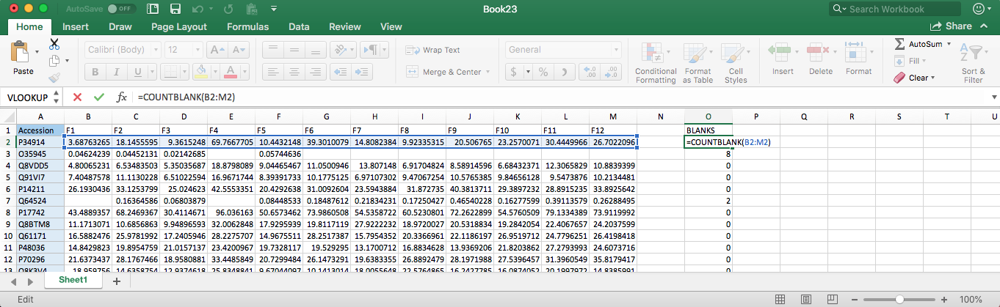
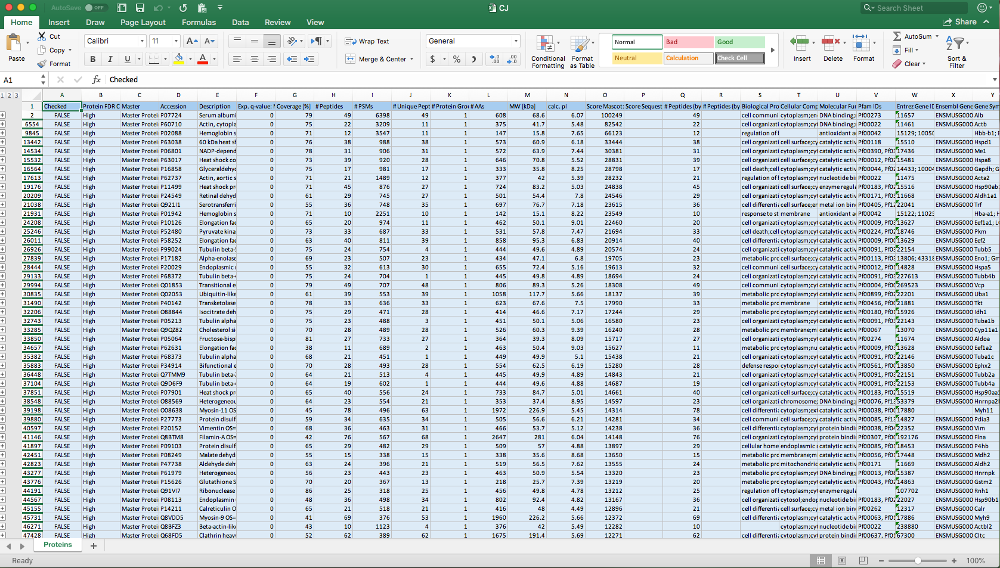
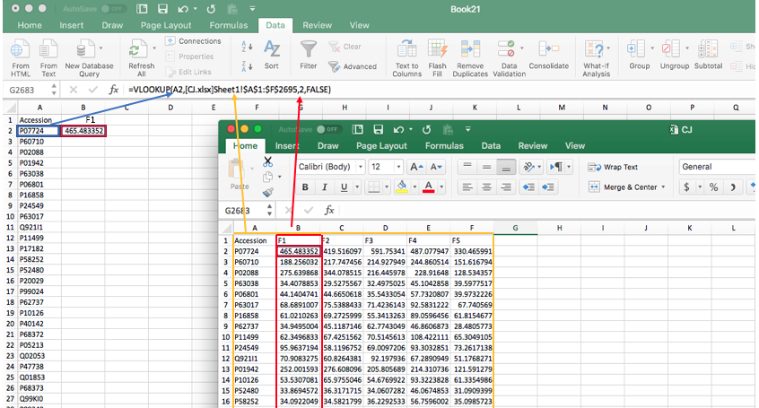
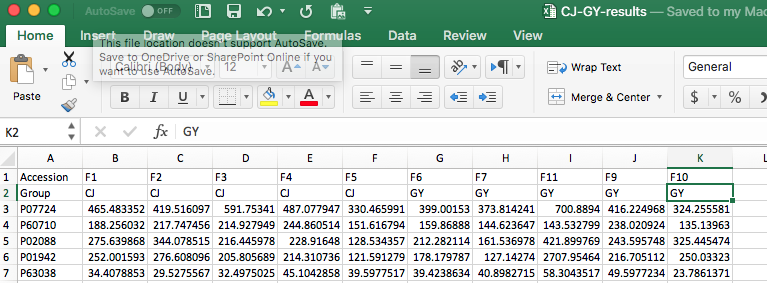
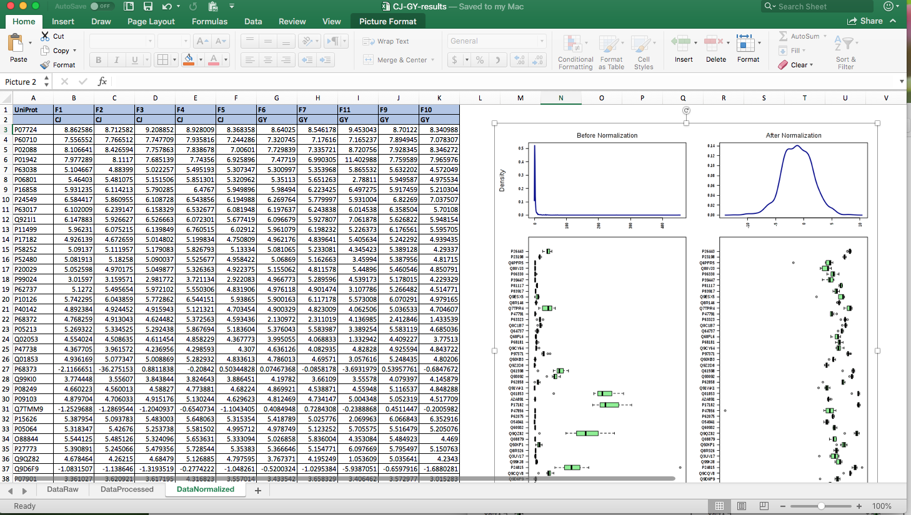
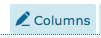
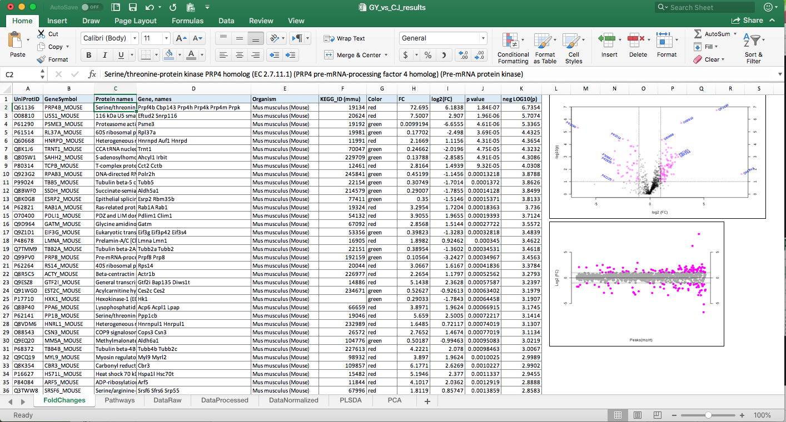
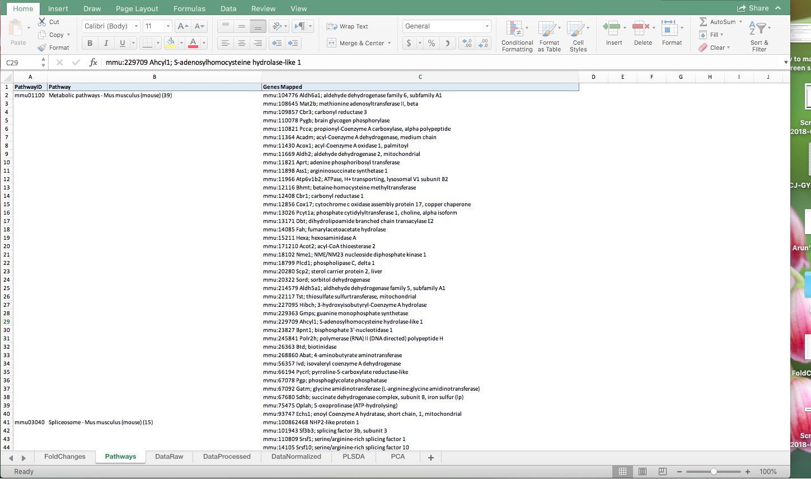
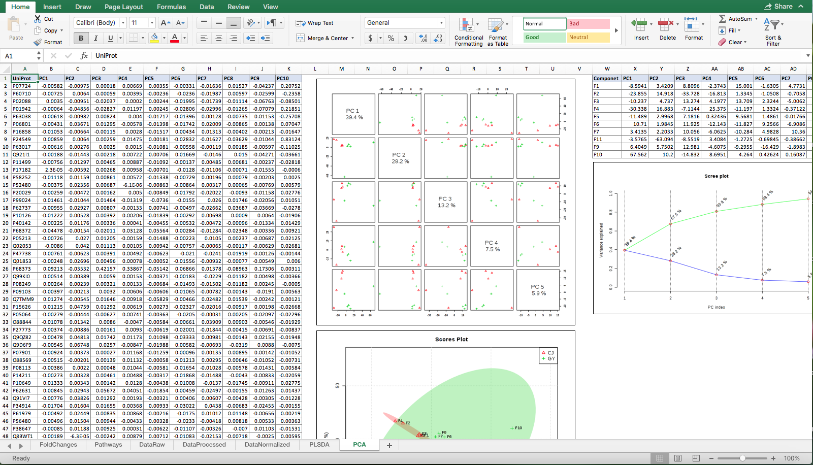
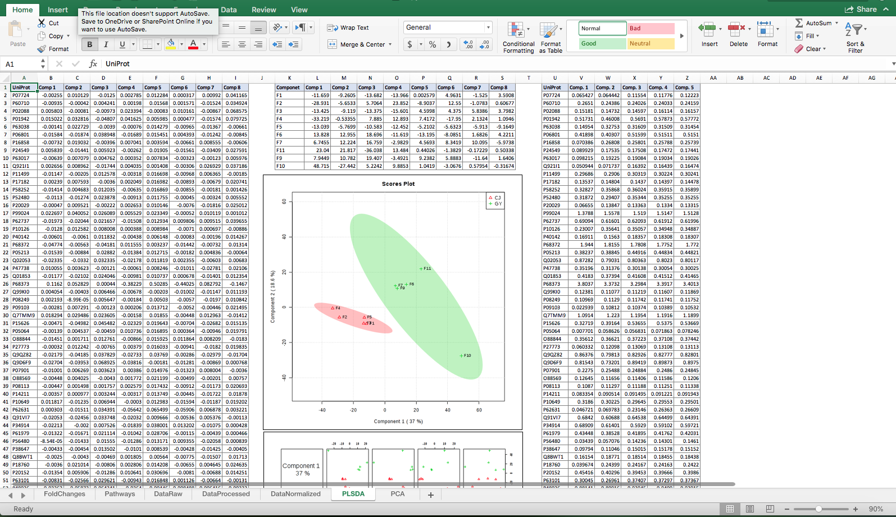

# Processing protein sequencing data

We are going to work a lot with Excel data sheets. Here are some short cuts and notes:

###### For mac
* Select all data cells : go to the first cell on the left. then command A. Note: If there is a blank line in data, the selection will stop when it reaches the blank line. Before selecting make sure to delete all blank lines.
* Select a column: Go to the first cell. shift + command + down arrow
* Select a row: Go to the first cell on the left. Shift + command + right Key
* Select several cells: Shift + arrow keys
* Paste only values not formulas ( This form of copy and paste is recommended. Regular paste could cause several errors if the original reference cell is not available). Copy the range of cells you want to paste.
Click `Edit > Paste Special`. In the Paste Special dialog box, Select `Values` from the Paste options. From now on we will refer to this as `special paste`.

## Evaluating Data

Before analyzing proteomics data we should evaluate it.
* Note: For less than 1000 proteins, there is not enough data points for  statistically significant analysis.

Count the number of zero abundances (blank cells in each row) for each protein.

Syntax:

`CountBlank(data-range)`

Example:


Now you can make a histogram of the number of blank cells.

Syntax:

`COUNTIFS(data-range, criteria1, [data range for criteria 2, criteria2])`

For each bin `COUNTIFS` function counts the number of data points that satisfy the criteria1 ( less than the higher bin value) and criteria 2  (more than and equal to the lower bin value).
For the above example, the range for bin criteria is form -1 to n, where n is the number of conditions ( Abundance columns).


Pay enough attention to the ratio of proteins with no abundance relative to the ones that are abundant in all of the conditions.

## Preprocessing data

First thing we notice is that the raw data consist of several levels that are grouped together. We are interested in the outer most level shown by the lowest number, usually 1.



In order to copy only level 1 of the data, make sure the data on other levels are collapsed to level 1 as shown in the above example. Select all data cells (Command A in mac).
Now we need to select only the invisible cells:

* Mac user:

```
 Edit > Find and then select "Go to"
 Click Special
 Choose "Visible cells only"
 Click OK
```

Now copy the selected cells and special paste in a new sheet.

There are still a lot of information in the data file that are not useful for our analysis. The columns that we need are:
* Accession
* Abundances

In the next step lets delete all the other Columns. For consistency rename the Abundance columns F1 ... Fn.

For example:

`Abundances (Grouped): F9, GY, Sample` will be renamed to `F9` and will be referred to as replicate F9.

### Normalization:

At the end of the data file there are different PRTC values for each replicate. We need the average over all the PRTC values for each replicate.  You can use AVERAGE(number1, [number2],...) function in Excel.

For each replicate, we will normalize each abundance by dividing it by the average PRTC of the corresponding replicate.

* Note: You can skip the next three sections and go to `Merging data files` if you are familiar with the autofill capability of Excel and know how to normalized values.

##### Calculating the normalized values:

Select the cell you wan to have the normalized abundance value. In the cell enter:

      =[Address of the raw abundance value cell]/[Address of the average PRTC cell for that replicate]

 and press Enter. The normalized value will be calculated in the chosen cell.

  Double Click on the chosen cell. The formula will be shown. We are going to repeat the calculation for the whole column. In each cell the normalized value is calculated using a different Abundance number but the RTCL value will be the same for the whole replicate. If we use autofill at this step Excel will shift the RTCL cell at each step. To fix the position of the RTCL cell, use `$` before the the column and row number of the RTCL cell in the shown formula and hit Enter again.

  Example:

      =B2/$I$2

  where B2 is the address of the cell containing the abundance and I2 refers to the cell containing the average RTCL.

##### Autofill

  Select the cell containing the formula. Move the cursor over the little block in the lower right corner of the active cell. The  cursor changes to a hairline `plus sign`. Double click on the plus sign  and the normalized values will be calculated for the  first replicate.

  * important note:

    Make sure that you choose a new cell that is adjacent to the replicate cells. Autofill needs to recognize the end of the data cells to stop the calculations and it can not do that if there are empty cells in between.

    For the same reason choose the cells in the same row otherwise autofill stops calculations whenever it reaches the end of the replicate column regardless of the number of cells it needs to repeat the calculations.

  Repeat that for all the replicates. Now we have a set of normalized abundances.


##### Zero and #VALUE! cells:

If any accession has no abundance in the data set the corresponding cell will be empty and the autofill return  #VALUE! for that cell. We need to replace these with blanks.

* In Mac:

  In the search field , click the magnifing glass, and then click `advanced search`. Enter what you want to replace, in this case `#VALUE!` in the `Find what` box. Select `Values` from the `Look in` pop-up menu. Click `replace`. Leave the `Replace with:` box blank and click `Replace All`.    


Copy and special paste (values) the accessions and normalized abundances in a new sheet and save it.


### Merging two Excel files:

Open a new Excel sheet. Copy the accession column from each data file and insert them all in the same column in the new sheet.

* Note:

  Use `insert` instead of `paste` to add new data cells to the old ones. Otherwise each time you paste, the old cells will be overwritten.  

Now we need to remove the duplicates.

 * Select the range of cells.
 * On the `Data` tab, under `Tools` click `Remove Duplicates`.
 * Check `select all` and `Column <x>` where x is the address of your column.
 * Click `OK`.

Now we use `vlookup` function.

Syntax:

```
=VLOOKUP (lookup value, range containing the lookup value ,col_index in the range that contains the return value, TRUE for Approximate match or FALSE for exact match)
```
 The lookup values are each of the non-redundant accessions copied in the new sheet. Our first lookup value is the first entry in the accession column. select the cell next to it. Use VLOOKUP function. The values are:

 * Lookup value: first Accession value
 * Lookup value range: all the cells from the Excel sheet containing the replicate of interest.  
 * Col_id : Column number of the replicate in the lookup value range
 * False for exact match

 ###### Example:

    =VLOOKUP(A2,[CJ.xlsx]Sheet1!$A$1:$F$2695,2,FALSE)



Use autofill. Repeat for all the replicates by changing the Column-id and the Excel sheet address.

Copy all the cells and special paste in a new sheet. Replace all `#VALU!`,`0` and `N/A` values with blank.

Add a row detailing the condition (group) for each replicate.

###### Example:

 

### Delete the entries with no abundance
Select all abundance columns. From the `Data`
 menu, click Filter.
 Copy all the cells, special paste and transpose the copied cells in a new sheet. Save the Excel file as a `.csv` file. The input file is ready.


---------------

## MetaboAnalyst

[MetaboAnalyst](http://www.metaboanalyst.ca/) is a set of online tools for metabolomic data analysis and interpretation.

#### Uploading Data

Click on the `click here to start` on the welcome page of [MetaboAnalysit web page](http://www.metaboanalyst.ca/). Choose `Statistical Analysis` from the menue. On the `Upload` page, select `Peak intensity table` for `Data Type` and `Samples in rows` as the `Format` and Browse your computer to select the `.csv` input data file. Click `Submit`.  

 #### Missing value estimation

 After uploading your file, choose `missing value estimation` option at the end of the data processing report page.

 In `Step 1` check the box `Remove features with` and type `50` for `% missing values`.
 In `Step 2` choose `Estimate missing values` from the menu and select `SVD Impute` from the box. Click `Process`.

 #### Data Filtering

Select `interquantile range(IQR)`. Click `Submit` and then`Proceed`

* Note :

Make sure that you submit the appropriate chosen method. The default is `no filtering` and if you `proceed` without `submitting`, the filtering will not be in effect.  

#### Normalization Overview

For `Sample normalization` select `None`. Select `Log transformation` for ` Data transformation` and `None` for `Data Scaling`. Click `Normalize`.
Click `Proceed`.

#### Some useful analysis pathways to explore

* Fold Change analysis:
Choose `2` for `Fold change threshold`. Choose `Comparison type` based on your data. Keep in mind that fold change is `treatment/Control`. So if your initial columns in the input data file are Control experiment, you should change the `Comparison type` and `submit` the changes. Do the same thing for `Volcano plot` ( coming next). The plots are generated by default. Therefore every time a new setting is submitted, a new plot will be generated. Be careful to choose the correct plot for your report.  
* T-test
* Volcano Plot: The default thresholds for `Fold change` and ` P-value` are 2.0 and 0.1 respectively. Make sure to choose the correct `Comparison type` ( For more information please read Fold Change analysis above). The default thresholds are meant for choosing the significant data point which are over or under expressed. To include all data points in analysis (for comparison) change the `Fold change` and `P-value` threshold to 1 and 5 respectively and submit again.
* Correlations: select `Detail View` from `View Mode` option menu. Click `submit`.
* PCA
* PLSDA
* sPLSDA
* Dendrogram
* Heatmap :  Select `Use top:` from `View Mode` menu and enter `100`. Click `Submit`.
* Generate Report

## Reporting analyzed data

Download the zip file form `MetaboAnalyst` website. Add  `data_original`, `data-normalied` and `data-proccessed` Excel files as separate sheets in one Excel workbook. Skip the next section if you know how:

#### Copy a Worksheet in Excel

Open the Excel files. On the sheet you want to copy, right click on the sheet tab. Choose `Move or Copy..`. In the `Move or copy` dialog box, select the name of the book you want to add the sheet to from `To book:` menu. In `before sheet:` box you can choose the order that you want the new sheet to be entered among the current sheets or you can choose `move to end`. Click `OK`. The sheet will be added to your desired workbook.

Just for consistency reorder and rename the sheets to `DataRaw`, `DataProcessed` and `DataNormalized`. Also hide gridlines on each sheet.

* Note: On mac for Excel version 2016 and higher, simply click the `Page layout` tab. Under the `Gridlines`, clear the `View` check box.

Insert norm.png from downloaded directory in `DataNormalized` sheet.

##### Example of Excel file:



### Fold Change analysis

From the downloaded directory, open `volcano.csv` file. Rename columns as `UniProtID`, `FC`, `log2(FC)`, `p value`, and `neg LOG10(p)`. Sort p-values from low to high. Select proteins with p-values higher than 0.05 and change the text color to gray. The unselected ones are the significant proteins that we are going to continue the analysis for. Copy the Uniprot IDs for the significant proteins.
Go to [UniProt website for retriving protein IDs](https://www.uniprot.org/uploadlists/). Paste the protein IDs in `Provide your identifiers` box. In `Select option` section, select From:`UniProtKB AC/ID` and To: `UniProtKB` and submit. Mapping results will be presented in a table. Above the table, from the menu bar select `edit-Columns` .
From `Name & Taxonomy` menu bar select `Entry name`, `Gene name`, `Organism`, `Protein names`. From `Genome annotation` menu bar select `KEGG` and save.
Click `Download`. In the Download box, select `Downlaod all`. Choose `tab separated` for the format and click `go`. Import the `.tab` file in Excel and select `tab` as your `Delimiter` to import data. In the header row rename  `Cross-reference (KEGG)` to `KEGG_ID(mmu)`. KEGG ids are reported as `mmu:x;` where `x` is the KEGG id number. Replace all `mmu:` and `;` in the KEGG ids with blank.

Note: Some accessions have several KEG IDs all of them point to the same Pathway ( Next section). Therefore, we save the first KEGG ID and discard the rest.

Next, insert new column between `KEGG_ID` and `FC` and name it `Color`.
Color is assigned to each protein based on the log2(FC) value.

Syntax:

`IF(log2(FC) < 0 , "Green", "Red")`

Repeat that for all proteins.

 Copy `Protein names`, `Gene names`, `Organism`, `KEGG_ID(mmu)`, and `Color` to the report workbook as a new sheet named `FoldChanges`.  

 Finally the volcano and the T-test plots.

* Example



### Pathway analysis:

Copy `KEGG_ID` and `Color` columns to a new sheet. We need to remove the entries with blank KEGG ids. Use `Filter` to unselect the `blanks` and copy the entires again.
Go to [KEGG Mapper](https://www.genome.jp/kegg/tool/map_pathway2.html) web site. On the `Search&Color Pathway` page, insert the copied KEGG ids and colors in the box under `Enter objects:`. Now we need to choose the organism we want to search against. click on `org`. In the `Find organism` popup box enter the KEGG organism code or the organism name. Click ` Exec`.

In the result page, the first section is dedicated to the the proteins that no pathway were found for them.
Move on to the pathway list. Click `Show all objects` to get the full pathways. Add all the pathways to the report workbook on a new sheet named `Pathways`. Separate `PathwayID` from `Pathway` in different columns. Skip the next section  `How to delete empty lines on Mac` if you know how to do it.

Example:



* How to delete empty lines on Mac :

  open a new TextEdit file. From `Edit` menubar select `Paste and Match Style`.

 Enter `command F` to open the search box.

  Replace `mmu:` with ` mmu:` or (\tmmu:)

  Delete empty lines by replacing two new lines with one (or \r\n\r\n\ with \r\n\)

  Copy the data from TextEdit and special paste as `Unicode Text` on a new Excel sheet.

  shift pathways ( col 2 ) one cell up. Then filter the blanks and copy new cells to a new sheet. Rename the new sheet `Pathways` and add that to the workbook.

### PCA Analysis

Add `pca_loadings.csv` from the downloaded folder to the report workbook in a new sheet called `PCA`. Copy `pca_score.csv` data in `PCA` sheet and inset PCA score, PCA Pairs  and PCA screen plots in `PCA` sheet.

Example:


### PLSDA Analysis

In a new sheet named `PLSDA` for consistency and insert `plsda_score.csv`, `plsda_vip.casv`, and `plsda_loadings.csv` data in `PLSDA` sheet. ALso add `pls_score.png` and `pls_pair.png` figures to the sheet.

* Example


